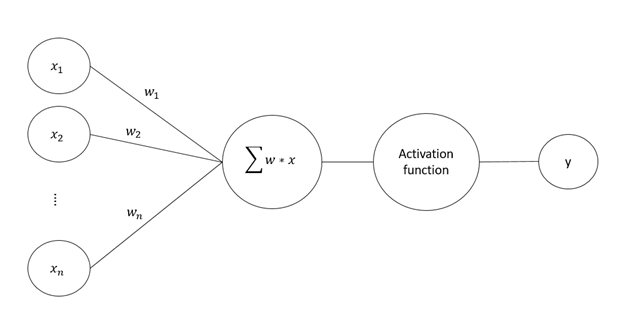

# NaturalLanguageProcessing--ReviewClassifier

## OUTLINE/COVERAGE

* NATURAL  LANGUAGE PROCESSING AND A NEURAL NET

* BAG OF WORDS MODEL

* WORKING OF MODEL

* SCREEN SHOTS OF WORKING MODEL

* CONCLUSION

* CONFUSION MATRIX

* COMPARING Y_TEST AND Y_PRED

* THANK YOU

## NATURAL  LANGUAGE PROCESSING AND A NEURAL NET

* Natural Language Processing is a branch of Artificial Intelligence which deals with making computer understand, interpret and manipulate human language along with  analyzing of textual content or data to make some sense out of it. 
* This project deals with creating a review classifier using this natural language processing technique in addition with neural networks for learning process.
* A Neural Network is basically a series of algorithms that deals with recognizing the relation in data sets in a way that human brain does.  
* So creating a review classifier basically deals with creating a  classifying model that would take a data set of reviews and would find the relation between the input and output. And later when the model would train itself to recognize the relation itself, it can be used to perform the required classification
* The method we are using comes under supervised learning, as we are using labeled data set for learning purposes. Data set basically consists of two columns, first column having all the reviews and second column contains label to define whether the review is positive or not. That means a positive review would be marked as 1 and negative review would be marked as 0.

## BAG OF WORDS MODEL

  

* The bag-of-words model is a way representing text data when modeling text with machine learning algorithms.
* When working with textual content its important to understand that machine learning algorithms are mathematical in nature, so its not possible to process raw text directly into machine learning process. So bag of words is basically a feature extraction or feature encoding algorithm that provides solution to this problem by converting the textual content into the vector of numbers.
* Implementing BAG OF WORDS MODEL
  * Text preprocessing
  * Vectorizing the text
  * Using the vectorized data set as input in some prediction algorithm(Neural net in our case)

## TEXT PREPROCESSING

* Text preprocessing is one of the most important steps that is done before performing any NLP technique on data set.
Text preprocessing or text cleaning basically deals with removing of all unwanted words from text that doesn’t contribute anything to the model classification logic, For example I , am , the , it etc. And then converting the words into their base form like for example likes → like, hating → hate etc.
* General steps involved in text cleaning.
  * Normalization: Deals with removing noise from data in form of unnecessary punctuation signs like ‘,”<!,etc.
  * Stopping Word: Deals with removing stopping words like a, the, an, on etc.
  * Stemming: Deals with changing the words into their base version like hating → hate, badly → bad etc.
  
## TEXT VECTORIZATION

  

* Text vectorization is the process through which the textual content is converted into integers by which it can be processed in any machine learning module.
* This is one of the most important part in bag of words model, the core of this model lies in this step.
* Python has a library which performs this vectorizing operation named CountVectorizer. Above code creates an object of CountVectorizer which later fits itself to training data and transforms the data set into vector of integers form.

  

* So this vectorized data set basically have 1500 columns representing 1500 unique words which contribute to classification of a review. And each row represents a single review with 0 representing the word not present in review and 1 representing word present in review. 

## WORKING WITH NUERAL NET

  

* So our neural network is basically working as logistic regressor.  As we are using sigmoid activation function at the output layer. Which gives the output between 0 to1.
* Library used  KERAS (Framework To Build Neural Networks)
* Three layered Neural Network
* First layer: Input Layer (dimension [1,15000])
* Second Layer: Activation Layer (activation function used: RELU (rectifier)) (dimension [1,700]
* Third Layer: Output Layer (activation function used: Sigmoid )
* Loss Function used: Binary Cross-Entropy  

  

* Optimizer used: Adam Optimizer

## WEIGHTS AND ACTIVATION FUNCTION

  

* Weights are the core element in the neural network through which the learning process is done.
* It is weights that are adjusted in the process of learning in order to predict the output.
* Activation function of a node defines the output of that node given an input or set of inputs.
* In this problem statement of review classifier we have used RELU and SIGMOID function as two activation function.
* RELU function will be used for making decision that which node is participating more decision making process.
* SIGMOID is used in output layer for predicting the output.

## LEARNING IN NEURAL NETWORK

  

* FORWARD PROPAGATION: The forward propagation is the process in which the input is feeded  to a neural network and the data flows from one layer to another getting processed on the way by the hidden layer’s activation functions. It is also called feed forward. This process ends with predicting the final output.

* BACKWARD PROPAGATION: The backward propagation is the process in which the loss generated from the predicted values and actual value comparison is propagated backward in the neural network in order to minimize the loss function and update the weights and bias so that the neural network keeps on learning on each iteration.

* As an input to our neural networks input layer we feed our data set row wise. Each neuron in input layer represents a word that would play a unique role in defining whether a review is positive or not.

* Input layer has 1500 Neurons  and our data set have 1500 columns each word representing a column.

* On feeding a row to an input layer. Respective neurons get triggered and forward propagation gets initiated. Data flows from layer to layer getting processed by the activation function applied on each layer.

* On reaching the output layer, the output value is compared with the actual value and the loss is calculated which is than back propagated to the neural network for updates of weights and bias.

* The steps are done in iterative manner until the loss is minimized.  

## CONCLUSION

  

* So on training the data set using this neural network we were able to create a classifier which was able to classify whether a review is positive or not
* So, on  training for 100 epochs we reached upto the accuracy level of 0.9962

## CONFUSION MATRIX
  
  

## COMPARING Y_TEST AND Y_PRED
  
